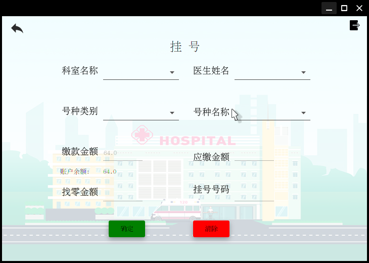
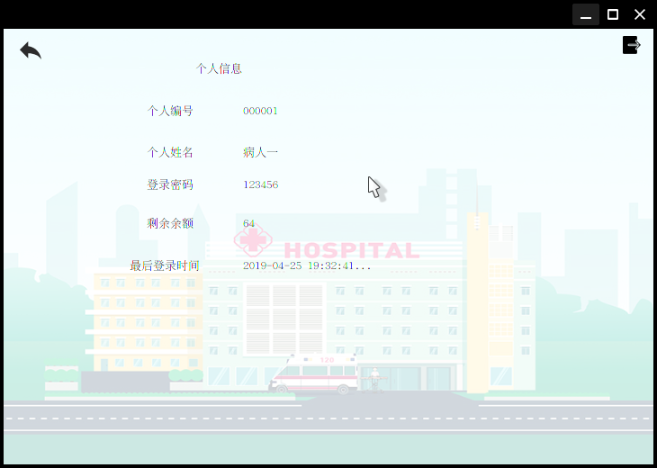
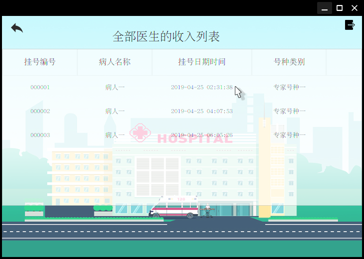
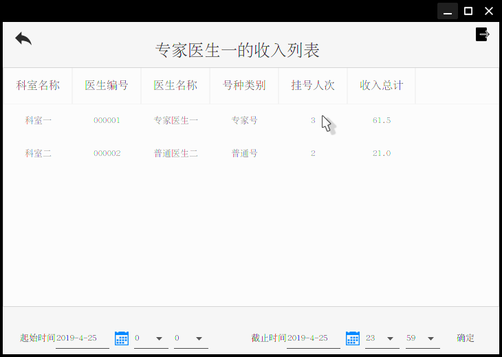

# 界面

`jfoenix`

### 登录界面

### 病人界面

### 挂号界面

### 个人信息界面

### 全部医生收入界面

### 医生收入列表界面

# 技术栈

数据库池 c3p0 

线程池 ThreadPoolExecutor 

日志 **SLF4J**

框架  mvp架构

# 实验要求文档

[文档]()

# 数据库建立sql文件

[hops.sql](./hosp.sql)

# 数据库时区需要修改